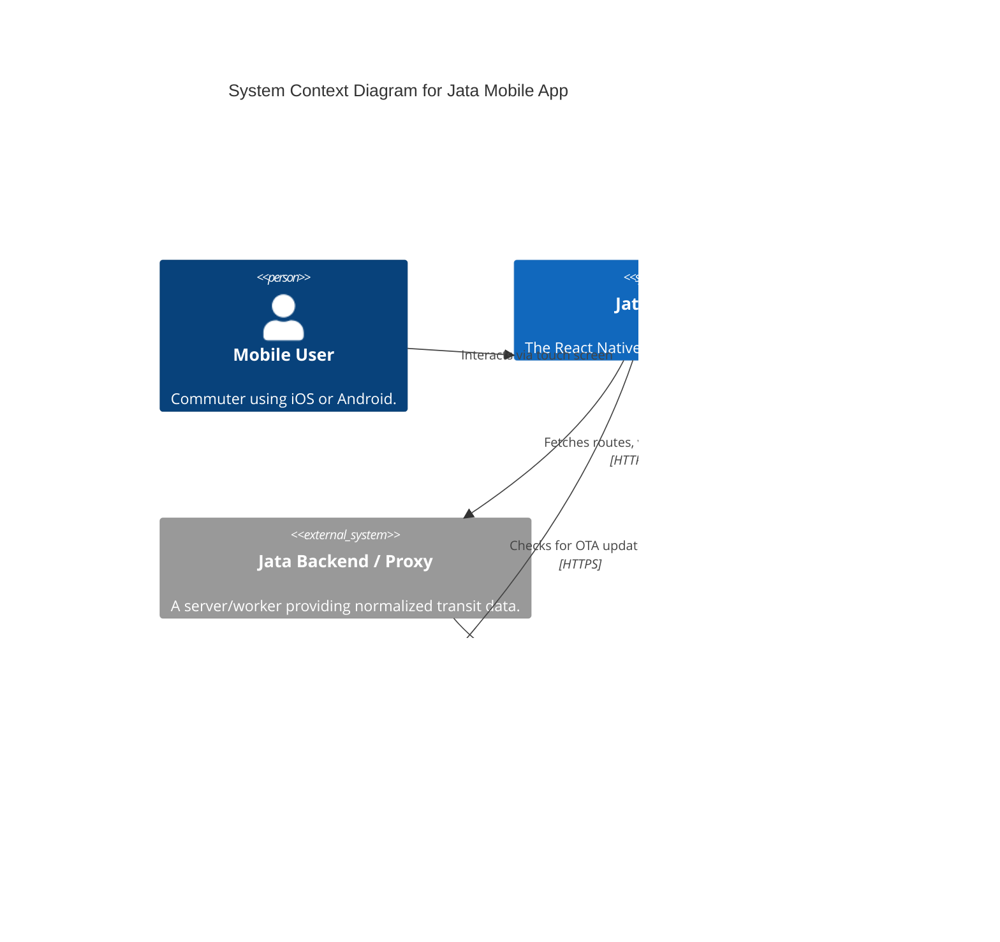
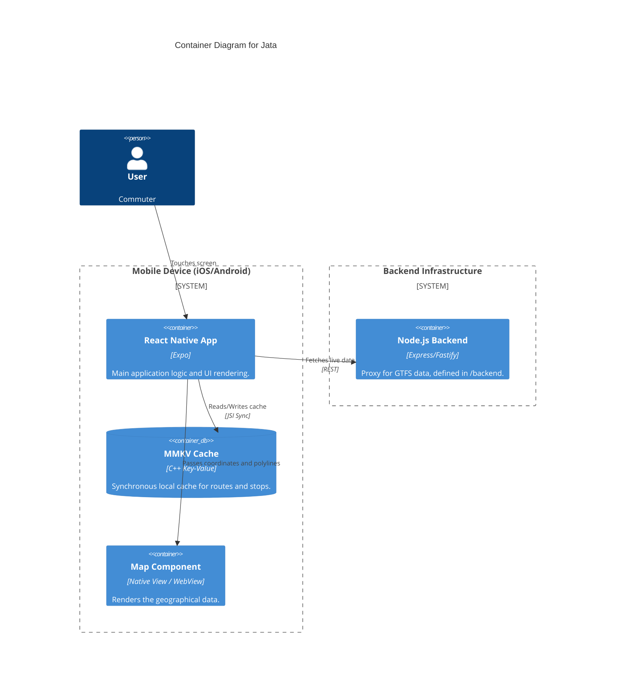

# High-Level Design (HLD)

## System Overview

Jata is a mobile client architecture. It does not interface directly with the transit agencies in most cases; rather, it communicates with a backend proxy layer (like the `gta` Cloudflare Workers or its own `backend/` service) to retrieve optimized routing and vehicle data.

### Core Pillars
1. **Frontend App**: React Native (Expo) providing the UI, navigation (`@react-navigation`), and local state management.
2. **Backend Services**: A lightweight backend (Node.js/Docker) used for proxying requests, handling push notifications, or managing API keys.
3. **Local Storage Layer**: A hybrid approach using `expo-secure-store` for sensitive tokens and `react-native-mmkv` for high-throughput transit data caching.

---

## Context Diagram

---

## Container Diagram

